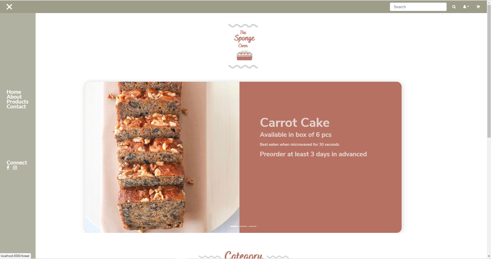

## Objectives

This is the e-commerce site for The Sponge Oven.

## Run this project

<b> Step 1   : git clone/download this project</b>  
` git clone https://github.com/AbrialWong/TheSpongeOven.git` 

<b> Step 2: Change directory to ecommerce-site</b> 
`cd ecommerce-site`

<b> Step 3: Download the missing dependencies</b> 
`npm install or npm i`

<b> Step 4: Run the project </b> 
  `npm start`

## Output

<b>Homepage</b>

## Authors

<a href="">Abrial Wong</a>

## Copyright

All images and details used in this project belongs to <a href="https://github.com/AbrialWong">Abrial Wong</a>. Do not mis-used it in any way or delete away this file. Thank you.

## Acknowledgments

Special thanks to:-

1) https://www.digitalocean.com/community/tutorials/react-server-side-rendering

2) https://css-tricks.com/hamburger-menu-with-a-side-of-react-hooks-and-styled-components/

3) https://medium.com/swlh/import-components-in-react-like-a-pro-b1340cb76a1b (Barrel Pattern)